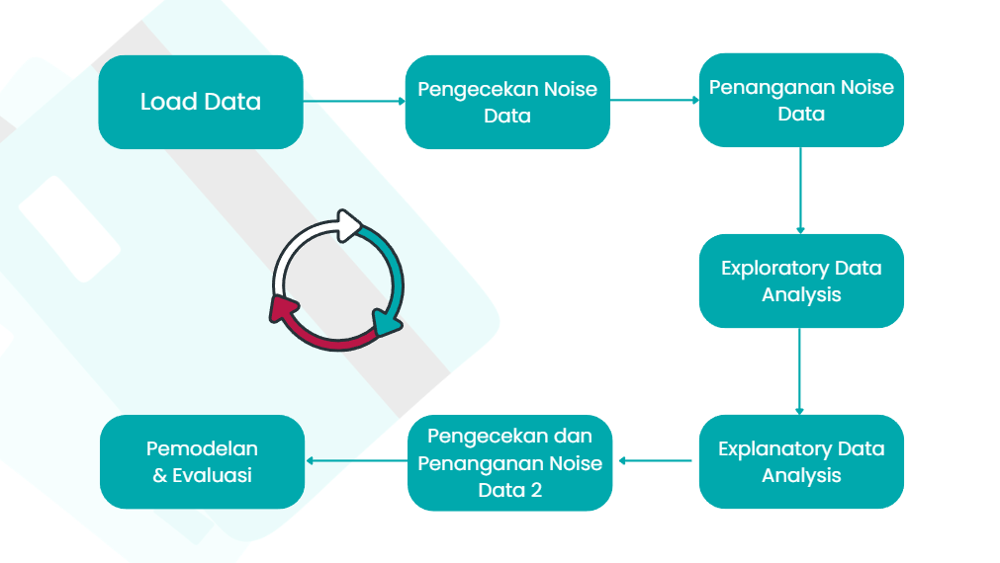
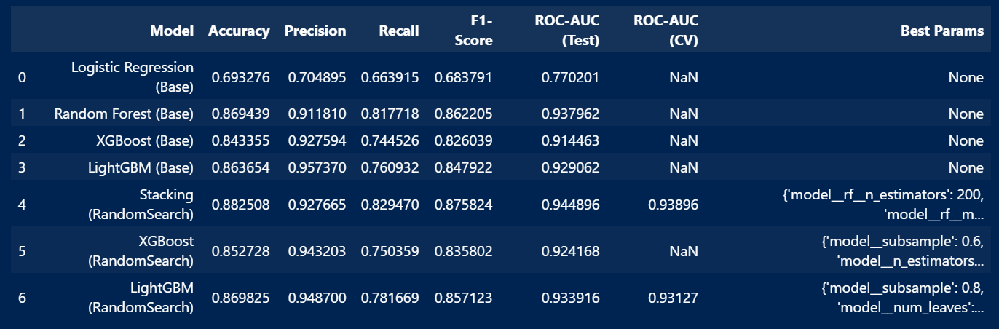

# Credit Risk Classification

## Deskripsi Singkat

Proyek ini bertujuan membangun model prediksi risiko kredit menggunakan data pinjaman, dengan berbagai teknik preprocessing, feature engineering, balancing, dan pemilihan model terbaik untuk deployment.

## Struktur Folder/Files

- `Analysis_Process.ipynb` : Notebook analisis awal dan eksplorasi data.
- `Modelling_Process.ipynb` : Notebook utama untuk preprocessing, feature engineering, pemodelan, tuning, dan evaluasi.
- `for_modelling.csv` : Dataset utama untuk pemodelan.
- `visualize_bi.csv` : Dataset tambahan untuk visualisasi.
- `models/` : Folder hasil penyimpanan model terlatih (.pkl).

## Alur Proses

## Hasil Evaluasi

## Deployment & Model Terbaik

Model LightGBM + Hyperparamter tuning dipilih untuk deployment karena memberikan performa tinggi (ROC-AUC dan metrik lain sangat baik) serta ukuran file yang efisien, sehingga ideal untuk implementasi nyata.

## Dependencies

- Python >= 3.8
- pandas
- numpy
- matplotlib
- seaborn
- scikit-learn
- imbalanced-learn
- lightgbm
- xgboost
- joblib
